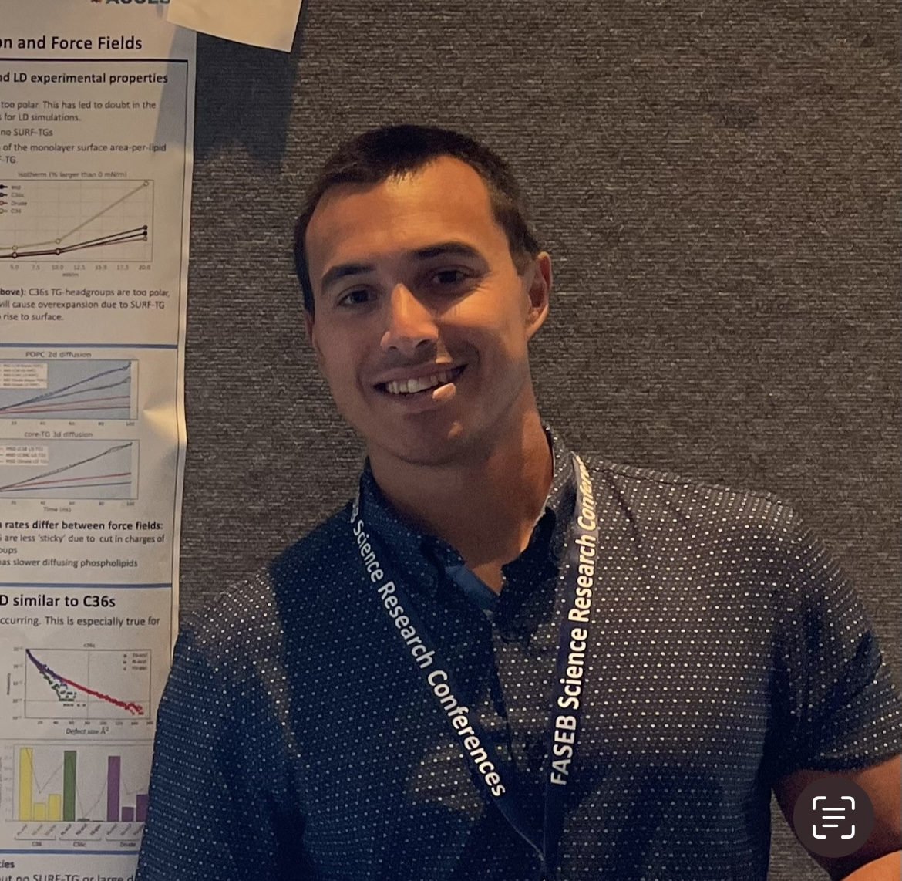

# Jay Braun

I’m a computational chemist by training. 

My expertise lies in scientific programming, molecular dynamics simulations, force field development, and data-driven analysis. I use tools like GROMACS, OpenMM, MDAnalysis, and Python-based workflows to investigate biomolecular systems, lipid droplets, and protein-membrane interactions.

##  About Me

- PhD in Computational Chemistry  
- Experienced in high-performance computing, force field optimization, and enhanced sampling  
- Passionate about bridging physical models with biological insight  
- Currently seeking roles in industry involving molecular simulation, data science, or scientific computing  

## Projects

### Lipid Droplet Targeting by MLX
Uncovered how MLX family proteins selectively associate with TG-rich LDs via simulation and MSMs.

- GROMACS & OpenMM simulation pipeline  
- WHAM + umbrella sampling for free energy analysis  
- MSM construction with pyEMMA  
- [Publication link or preprint]  

###  Drude Force Field for TGs
Refined polarizable models (Drude2023) for TG-rich environments, improving interfacial accuracy.

- Benchmarked Drude vs CHARMM36  
- RDF, density, and surface potential validation  
- [GitHub repo link or DOI]  

### Surface Defect Analysis
Custom Python analysis tools to identify lipid packing defects and correlate with protein binding events.

- MDAnalysis and custom vectorized logic  
- Visualization via Seaborn and Matplotlib  
- [Repo link]

## Resume

You can view or download my resume here:  
[Download Resume (PDF)](link-to-resume.pdf)

## 📫 Contact

- Email: your.email@example.com  
- LinkedIn: [Your LinkedIn](https://linkedin.com/in/yourname)  
- GitHub: [@jaybraunjr](https://github.com/jaybraunjr)

---

Thanks for visiting!
