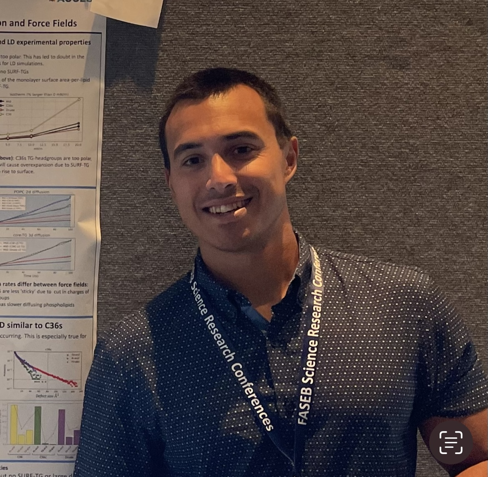

  

    
    <h1 style="margin: 0; font-size: 1.8rem;">Jay Braun</h1>
  

  <video autoplay muted loop playsinline width="600" style="max-width: 100%;">
    <source src="tica_fast2.mp4" type="video/mp4">
    Your browser does not support the video tag.
  </video>

I’m a PhD computational chemist by training. My work invovled exploring how proteins interact with biological membranes (as seen in the movie above).

  I specialize in scientific programming, molecular simulations, and data-driven analysis, with a focus on clear communication. I'm seeking roles in data science, technical writing, analytics, or as a computational chemist.

# Projects and Documents
Here are some materials from my recent work. This includes published manuscripts, code repositories, and grant proposals.
[View full project portfolio](projects)

## Educational Background
- Ph.D. in Computational Chemistry from the University of Utah 
- B.S. in Chemistry from Northern Arizona University

## Core Skills
- Programming & Scripting: Python, Bash, Linux, high-performance computing  
- Data Analysis & Visualization: NumPy, pandas, Seaborn, Matplotlib, Excel  
- Databases & Querying: SQL 
- Scientific Communication: Technical writing, research presentations, data visualization
- Computational chemsitry: GROMACS, OpenMM, MDAnalysis, CHARMM

## Contact

- Email: your.email@example.com  
- LinkedIn: [Jay Braun](https://linkedin.com/in/jaybraunjr)  
- GitHub: [@jaybraunjr](https://github.com/jaybraunjr)

